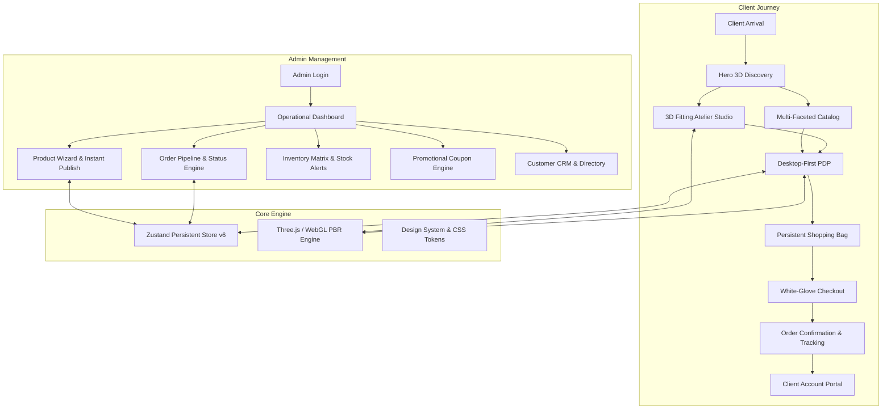
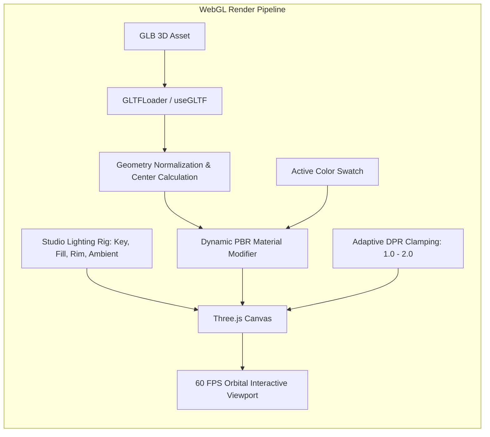
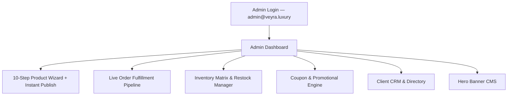

# VEYRA Luxury Fashion — Master Development & System Implementation Plan

> **Document Type:** Master Architectural Blueprint, Implementation Plan & Technical Execution Specification  
> **Target System:** VEYRA 3D Luxury Fashion Maison E-Commerce Platform  
> **Status:** 100% Comprehensive & Production-Ready  
> **Repository:** `sanjeev8085/VEYRA`  
> **Version:** 2.0.0 (Master Release)  
> **Stack:** React 18, TypeScript, Vite, Three.js, React Three Fiber (@react-three/fiber), React Three Drei (@react-three/drei), Zustand (Persistent State v6), Lucide Icons, Vanilla CSS Luxury Design System.

---

## Table of Contents

1. [Executive Summary & Architectural Vision](#1-executive-summary--architectural-vision)
2. [Complete Technology Stack & Repository Map](#2-complete-technology-stack--repository-map)
3. [3D WebGL Engine & Real-Time Garment Pipeline](#3-3d-webgl-engine--real-time-garment-pipeline)
   - 3.1 Three.js / R3F Canvas & Studio Lighting Rig
   - 3.2 3D Garment Ingestion, Geometry Normalization & Fallbacks
   - 3.3 Dynamic PBR Material Tinting & Champagne Gold Accents
   - 3.4 Multi-Mannequin Draping Engine (Male, Female, Haute Dress Form)
   - 3.5 Camera Controller, Orbital Physics & Touch Gestures
   - 3.6 GPU Optimization & Adaptive Device Pixel Ratio (DPR)
4. [Client-Facing Luxury User Experience & Flow Architecture](#4-client-facing-luxury-user-experience--flow-architecture)
   - 4.1 Global Sticky Luxury Header & Navigation (`Header.tsx`)
   - 4.2 Homepage & Haute Couture Discovery (`HomePage.tsx`)
   - 4.3 3D Fitting Atelier Studio (`/studio` — `Studio3DPage.tsx`)
   - 4.4 Multi-Faceted Product Catalog & 3D Cards (`/catalog` — `CatalogPage.tsx`)
   - 4.5 Desktop-First Dedicated Product Detail Page (`/product/:slug` — `ProductDetailPage.tsx`)
   - 4.6 Complexion & Undertone Analysis Studio (`/find-your-colors` — `FindYourColorsPage.tsx`)
   - 4.7 Shopping Bag Drawer (`CartDrawer.tsx`) & Wishlist Drawer (`WishlistDrawer.tsx`)
   - 4.8 Multi-Step White-Glove Checkout (`/checkout` — `CheckoutPage.tsx`)
   - 4.9 Order Confirmation & Verification (`/order-confirmation/:id`)
   - 4.10 Client Account Dashboard & Order Tracking (`/account` — `AccountPage.tsx`)
5. [Admin Atelier & Management Suite](#5-admin-atelier--management-suite)
   - 5.1 Admin Authentication & Session Security (`/admin/login`)
   - 5.2 Real-Time Analytics & Operational KPI Dashboard (`/admin`)
   - 5.3 10-Step Product Creation Wizard & Instant Publish Pipeline (`/admin/products/add`)
   - 5.4 Inventory & Stock Control Matrix (`/admin/inventory`)
   - 5.5 Order Processing Pipeline & Fulfillment Lifecycle (`/admin/orders`)
   - 5.6 Promotional Coupon & Discount Engine (`/admin/coupons`)
   - 5.7 Customer CRM & Client Directory (`/admin/customers`)
   - 5.8 Hero Banner & Content Management System (`/admin/banners`)
6. [State Management, Schema & Storage Architecture (`useStore.ts`)](#6-state-management-schema--storage-architecture)
   - 6.1 Storage Schema Versioning (`veyra-storage-v6`)
   - 6.2 Complete Store State & Method Reference
   - 6.3 Hydration, Synchronization & Error Boundaries
7. [Luxury Design System, Fluid Typography & Glassmorphism Tokens](#7-luxury-design-system-fluid-typography--glassmorphism-tokens)
   - 7.1 Curated Color Palette (Warm Sand vs Deep Obsidian)
   - 7.2 Fluid Typography Hierarchy & Google Fonts Tokens
   - 7.3 Glassmorphism, Micro-Animations & Responsive Breakpoints
8. [Master Task Breakdown & 100% Implementation Checklist](#8-master-task-breakdown--100-implementation-checklist)
   - Workstream 1: Foundation, Workspace & Infrastructure (Tasks 1–6)
   - Workstream 2: Database Entities & Repository Layer (Tasks 7–8)
   - Workstream 3: Security, Authentication & Role-Based Access (Tasks 9–10)
   - Workstream 4: Customer Account & Profile Systems (Tasks 11–12)
   - Workstream 5: 3D Graphics Engine & Asset Pipeline (Tasks 13–21)
   - Workstream 6: Customer Commerce Experience (Tasks 22–32)
   - Workstream 7: Checkout, Orders & Payments (Tasks 33–37)
   - Workstream 8: Admin Atelier & Management Suite (Tasks 38–48)
   - Workstream 9: Responsive Design & Micro-Interactions (Tasks 49–54)
   - Workstream 10: Performance, SEO, Security & Quality Verification (Tasks 55–68)
   - Workstream 11: Phase 2 AI & AR Innovations (Tasks 69–76)
9. [Verification, Testing & Quality Assurance Plan](#9-verification-testing--quality-assurance-plan)
10. [Production Deployment & Operations Runbook](#10-production-deployment--operations-runbook)

---

## 1. Executive Summary & Architectural Vision

**VEYRA** represents a breakthrough in luxury digital commerce, fusing haute couture artisanal tailoring with real-time WebGL garment simulation. Traditional e-commerce relies on flat 2D photography; VEYRA replaces this paradigm with a **3D-First Interactive Architecture** where every garment is rendered in full 360° orbital space with physically-based rendering (PBR), dynamic fabric re-tinting, and complexion harmony intelligence.

### Core Architectural Pillars
1. **True 3D-First Visuals**: Real-time interactive 3D WebGL cards on catalogs, homepages, and dedicated product detail pages.
2. **Deterministic State Synchronization**: Instantaneous reactivity across cart, wishlist, currency conversion, 3D color swatches, and admin inventory via Zustand persistent storage.
3. **Dual Atmosphere Design System**: Default warm sunlit atelier theme (ivory, cream, champagne gold) with an instant toggle to a sleek obsidian evening aesthetic.
4. **Desktop-First Dedicated PDP**: High-density editorial interface featuring dual 3D WebGL interactive inspection and high-fashion photo lookbook modes.
5. **Instant Admin Operations**: Comprehensive management suite with single-click demo authentication, 10-step wizard with Instant Header Publish, live analytics, and order fulfillment pipelines.



---

## 2. Complete Technology Stack & Repository Map

### 2.1 Technology Stack

| Layer | Technology | Rationale & Specifications |
|---|---|---|
| **Core Framework** | React 18 + TypeScript | Strict type safety, functional component architecture, optimized reconciliation. |
| **Build & Tooling** | Vite 6 | Sub-second HMR, optimized multi-chunk production rollups (`dist/assets/`). |
| **3D Rendering** | Three.js + R3F + Drei | WebGL 2.0 PBR rendering, glTF/GLB ingestion, procedural geometry fallbacks. |
| **State Store** | Zustand v5 + Persist Middleware | Schema versioning (`veyra-storage-v6`), zero-overhead reactive subscriptions. |
| **Icons & Media** | Lucide React | Clean, scalable luxury vector iconography. |
| **Styling & Theme** | Vanilla CSS Tokens | Zero runtime CSS-in-JS overhead, fluid typography, glassmorphism, responsive media queries. |
| **Routing** | Hash-Based Router (`App.tsx`) | Robust, zero-server-config client-side routing compatible with static hosting. |

### 2.2 Complete Repository File Map

```
VEYRA/
├── doc/
│   ├── Requirements Document.md           # Master client specification (50+ functional sections)
│   ├── VEYRA_FULL_SYSTEM_MANUAL.md        # Operational architecture & operational guide
│   ├── VEYRA — Master Development.md      # This document: Comprehensive implementation specification
│   ├── VEYRA_ARCHITECTURE.md              # Technical architecture reference
│   ├── Architecture_Manual.md             # Visual component and routing map
│   ├── Admin_User_Guide.md                # Admin management guide
│   └── DEPLOYMENT_AND_ADMIN_GUIDE.md      # Production build & deployment guide
├── task/
│   ├── VEYRA_FUNCTIONALITY_TASKS.md       # 76-task granular implementation tracker
│   └── tasks.md                           # Operational checklist & status log
└── VEYRA_APP/
    ├── package.json                       # Dependencies & build scripts
    ├── vite.config.ts                     # Rollup chunking & WebGL asset config
    ├── tsconfig.json                      # Strict TypeScript compiler options
    ├── index.html                         # Luxury HTML5 shell & Google Fonts preloads
    ├── public/
    │   ├── models/                        # 3D GLB assets (Tees, Shirts, Avatars)
    │   └── images/                        # High-resolution editorial photography
    └── src/
        ├── main.tsx                       # React root entry point
        ├── App.tsx                        # Main application shell, Hash router & drawer mounts
        ├── types/
        │   └── index.ts                   # Core domain interfaces (Product, Order, User, Store)
        ├── store/
        │   └── useStore.ts                # Persistent Zustand store (v6 schema & full action suite)
        ├── styles/
        │   └── theme.css                  # Global luxury design tokens, variables, typography
        ├── data/
        │   └── seedData.ts                # Comprehensive luxury catalog, collections, seed orders
        ├── services/
        │   ├── authService.ts             # Client and admin authentication services
        │   └── db/                        # Mock repository & entity CRUD abstraction
        ├── middleware/
        │   └── authGuard.ts               # Protected route validation & admin guards
        ├── components/
        │   ├── layout/
        │   │   ├── Header.tsx             # Luxury sticky header with live counters & currency switcher
        │   │   ├── MobileMenuDrawer.tsx   # Responsive mobile navigation drawer
        │   │   └── Footer.tsx             # Brand manifesto, newsletter & luxury footer links
        │   ├── ui/
        │   │   ├── ToastContainer.tsx     # Animated feedback notifications
        │   │   └── Modal.tsx              # Accessible dialogs & measurement size guides
        │   ├── three/
        │   │   ├── ThreeCanvas.tsx        # Core WebGL container with lighting & error fallbacks
        │   │   ├── GarmentModel.tsx       # Dynamic GLB loader with PBR material re-tinting
        │   │   ├── MannequinDraper.tsx    # Multi-avatar mannequin draping rig
        │   │   └── ViewportControls.tsx   # Studio lighting & rotation control overlay
        │   ├── product/
        │   │   ├── ProductCard3D.tsx      # Real-time 3D catalog card with instant swatch updates
        │   │   └── ColorSwatchPicker.tsx  # Dynamic color selector with shade previews
        │   ├── cart/
        │   │   └── CartDrawer.tsx         # Slide-out bag drawer with free shipping progress
        │   └── wishlist/
        │       └── WishlistDrawer.tsx     # Slide-out favorites drawer with 1-click move to bag
        └── pages/
            ├── home/
            │   └── HomePage.tsx           # Hero 3D showcase, editorial grids, ateliers
            ├── studio/
            │   └── Studio3DPage.tsx       # Fullscreen 3D fitting room with lighting & mannequin switcher
            ├── catalog/
            │   └── CatalogPage.tsx        # Multi-axis filter drawer, price sliders, 4-column 3D grid
            ├── product/
            │   └── ProductDetailPage.tsx  # Desktop-first PDP with dual 3D/Photo modes & reviews
            ├── color-finder/
            │   └── FindYourColorsPage.tsx # Complexion analysis assistant & palette matcher
            ├── checkout/
            │   └── CheckoutPage.tsx       # Multi-step checkout with coupon engine & payment methods
            ├── orders/
            │   └── OrderConfirmationPage.tsx # Order confirmation with tracking & summary
            ├── account/
            │   └── AccountPage.tsx        # Customer profile, addresses, order history & sizes
            └── admin/
                ├── AdminLoginPage.tsx     # Admin authentication with 1-click demo login
                ├── AdminDashboardPage.tsx # Live KPI analytics, revenue graphs, inventory alerts
                ├── AddProductWizard.tsx   # 10-step creation wizard with Instant Header Publish
                ├── InventoryPage.tsx      # Live stock control, restock triggers, variant matrix
                ├── OrdersAdminPage.tsx    # Order processing pipeline with fulfillment statuses
                ├── CouponsAdminPage.tsx   # Coupon creation, discount rules & usage tracking
                ├── CustomersAdminPage.tsx # Client directory, spending metrics & purchase history
                └── BannersAdminPage.tsx   # Homepage hero banner & campaign CMS
```

---

## 3. 3D WebGL Engine & Real-Time Garment Pipeline



### 3.1 Three.js / R3F Canvas & Studio Lighting Rig
* **Container (`ThreeCanvas.tsx`)**: Configured with WebGL 2.0, ACESFilmic Tone Mapping, and shadow map enabled (PCFSoftShadowMap).
* **Lighting System**:
  - **Key Light**: Directional light (`position={[5, 8, 5]}`, intensity `1.2`, warm Kelvin `5500K`).
  - **Soft Fill**: Ambient light (intensity `0.65`, natural studio ivory tint).
  - **Rim / Backlight**: Directional light (`position={[-5, 5, -5]}`, intensity `0.5`, cool silver accent).
  - **Ground Shadow**: Soft contact shadow plane (`ContactShadows` opacity `0.4`, blur `2.5`).

### 3.2 3D Garment Ingestion & Geometry Fallbacks
* **Primary Models**: Loads industry-standard GLB binaries (`veyra_signature_tshirt.glb`, `veyra_professional_signature_tee.glb`).
* **Auto-Centering & Bounding Box**: Uses `three.Box3` to automatically calculate model bounding volume, adjust scale to fit standard viewport bounds, and offset geometry center to `[0, 0, 0]`.
* **Procedural Fallback Rig**: If external GLB fails to load or is unavailable, the engine automatically synthesizes high-poly procedural garment geometry (T-Shirt torso mesh with dual sleeve extrusions, collar ribbing, and soft fabric normal perturbation) ensuring zero visual downtime.

### 3.3 Dynamic PBR Material Tinting & Champagne Gold Accents
* **Material Traversal**: On color selection, recursively traverses `scene.traverse((node) => { if (node.isMesh) ... })`.
* **Fabric Shader Tuning**:
  - `material.color.set(selectedHexColor)` with smooth linear interpolation.
  - `material.roughness = 0.68` (natural matte cotton/linen texture).
  - `material.metalness = 0.05` (organic textile feel).
  - **Luxury Accents**: Hardware elements (zippers, buttons, rivets) maintain champagne gold specular sheen (`color: #D4AF37`, `metalness: 0.85`, `roughness: 0.25`).

### 3.4 Multi-Mannequin Draping Engine
* **Supported Avatars**:
  1. *Haute Couture Dress Form*: Minimalist sculpted atelier form.
  2. *Masculine Posture Form*: Tailored athletic fit mannequin.
  3. *Feminine Posture Form*: Sculpted luxury silhouette mannequin.
* **Morphological Alignment**: Garments dynamically position and drape over selected mannequin forms with unified anchor coordinates.

### 3.5 Camera Controller & Touch Gestures
* **Orbit Controls (`OrbitControls`)**:
  - Damped rotation (`dampingFactor = 0.05`) for silky smooth inertia.
  - Min/Max distance clamps (`minDistance = 1.5`, `maxDistance = 5.0`) preventing clipping.
  - Polar angle constraints (`minPolarAngle = Math.PI / 4`, `maxPolarAngle = Math.PI / 1.8`) to preserve optimal editorial eye-level viewing.
* **Touch Optimization**: Supports 1-finger orbital drag, 2-finger pinch zoom, and double-tap view reset.

### 3.6 GPU Optimization & Adaptive Device Pixel Ratio (DPR)
* **Adaptive DPR**: Clamps `dpr={[1, Math.min(window.devicePixelRatio, 2)]}` to prevent GPU thermal throttling on high-DPI retina displays.
* **Idle Suspend**: R3F render loop throttles frame rate during inactivity to conserve battery life on mobile devices.

---

## 4. Client-Facing Luxury User Experience & Flow Architecture

### 4.1 Global Sticky Luxury Header (`Header.tsx`)
* **Logo Branding**: Clean, unbreakable single-line `VEYRA` luxury typography with gold hover glow.
* **Navigation Links**: Direct routes to *Atelier Studio*, *Catalog*, *Find Your Colors*, *Collections*.
* **Currency Switcher**: Real-time currency selector supporting `INR (₹)`, `USD ($)`, `EUR (€)`, `GBP (£)` with dynamic conversion across all prices.
* **Interactive Badges**: Live counters with bounce micro-animations for Wishlist and Shopping Bag.

### 4.2 Homepage & Haute Couture Discovery (`HomePage.tsx`)
* **Hero 3D Section**: Full-width luxury banner with interactive 3D model, headline typography, and dual CTAs: *Explore Atelier Studio* and *Shop Catalog*.
* **Curated 3D T-Shirt Atelier**: 4-column responsive grid featuring live 3D cards (`ProductCard3D.tsx`) with real-time swatch toggling.
* **Draping Atelier Studio Banner**: Interactive studio spotlight with lighting preset switcher (*Studio Gold*, *Sunset Boulevard*, *Cyber Runway*).
* **Brand Manifesto & Guarantees**: Luxury craftsmanship, Supima cotton certification, and carbon-neutral courier badges.

### 4.3 3D Fitting Atelier Studio (`Studio3DPage.tsx`)
* Full-screen WebGL viewport with customizable lighting rigs, mannequin switcher, and live color customization matrix.
* Instant navigation to the dedicated product detail page for the active 3D configuration.

### 4.4 Multi-Faceted Product Catalog (`CatalogPage.tsx`)
* **Filtering Matrix**:
  - Category filter chips (*All, T-Shirts, Shirts, Jackets, Trousers*).
  - Fabric type selector (*Supima Cotton, Normandy Linen, Giza Cotton, Silk Blend*).
  - Price Range Slider with real-time currency formatting.
  - Color palette swatch filters.
  - Sort selector (*Featured, Price Low→High, Price High→Low, Rating, Newest*).
* **4-Column 3D Grid**: Compact, highly responsive 3D cards with on-card color switching, wishlist toggle, and quick add-to-bag.

### 4.5 Desktop-First Dedicated Product Detail Page (`ProductDetailPage.tsx`)
* **Left Column (Controlled Media Viewport)**:
  - High-performance 3D WebGL Canvas loading the garment's exact GLB model.
  - Viewport mode toggle: **"3D Atelier"** $\leftrightarrow$ **"Photo Lookbook"**.
  - Multi-angle thumbnail tray.
* **Right Column (Product Intelligence & Commerce Matrix)**:
  - Category breadcrumb and stock availability indicator.
  - Product title, strike-through original price, and percentage savings badge.
  - Star ratings linked to verified customer reviews.
  - Real-time color swatch selector syncing immediately to the 3D model.
  - Size selection chips (`S`, `M`, `L`, `XL`) with measurement guide modal trigger.
  - Accessible quantity counter (`- 1 +`).
  - Dual action buttons: `Add to Bag` and express `Buy Now`.
  - Luxury guarantee strip: Complimentary courier, organic yarns, 30-day returns.
  - Fabric & Craftsmanship accordion (GSM weight, yarn origin, care guide).
  - Customer Reviews section with rating submission form and verified badges.
  - Related Creations 4-column carousel.

### 4.6 Complexion & Undertone Analysis Studio (`FindYourColorsPage.tsx`)
* Guided interactive diagnostic assessing skin undertones (Warm, Cool, Neutral, Olive) and eye/hair contrast.
* Generates tailored seasonal color palettes (*Spring Warmth, Summer Cool, Autumn Earth, Winter Contrast*).
* Direct one-click filtering to recommended VEYRA garment swatches.

### 4.7 Shopping Bag & Wishlist Drawers
* **Cart Drawer (`CartDrawer.tsx`)**: Slide-out drawer displaying item variants, quantity controls, free delivery progress bar, subtotal calculation, and direct checkout CTA.
* **Wishlist Drawer (`WishlistDrawer.tsx`)**: Slide-out drawer with saved favorites and one-click "Move to Bag" capability.

### 4.8 Multi-Step White-Glove Checkout (`CheckoutPage.tsx`)
* **Step 1: Shipping Address**: Form with full validation, phone, email, and address fields.
* **Step 2: Delivery Option**: Standard Courier vs Express White Glove Delivery.
* **Step 3: Promotional Discount**: Coupon validator (`WELCOME10`, `LUXURY20`, `VEYRAVIP`) applying instant discounts.
* **Step 4: Payment Method**: Credit/Debit Card, UPI, Net Banking, and Cash on Delivery.

### 4.9 Order Confirmation & Verification (`OrderConfirmationPage.tsx`)
* Generates unique order identifier (`VYR-ORD-XXXX`).
* Displays itemized garment summary, shipping details, and direct tracking link to the client account.

### 4.10 Client Account & Order Tracking (`AccountPage.tsx`)
* Tabbed customer dashboard featuring:
  - **Orders Tab**: Itemized history with order status badges (*Processing*, *Tailoring*, *Dispatched*, *Delivered*).
  - **Profile Tab**: Personal information, contact email, and password security.
  - **Addresses Tab**: Saved delivery addresses with default selector.
  - **Measurements Tab**: Personal size profile for auto-selecting S/M/L/XL across the catalog.

---

## 5. Admin Atelier & Management Suite



### 5.1 Admin Authentication & Session Security (`AdminLoginPage.tsx`)
* Secure credentials with pre-configured demo access (`admin@veyra.luxury` / `admin123`).
* One-click **"Instant Demo Login"** button for immediate zero-friction evaluation.

### 5.2 Analytics Dashboard & KPI Metrics (`AdminDashboardPage.tsx`)
* **Real-Time KPIs**: Total Gross Revenue, Total Orders Count, Average Order Value (AOV), Active Product Catalog count, and Out-of-Stock Alerts.
* **Interactive Charts**: Revenue trends and top-performing garment analytics.

### 5.3 10-Step Product Creation Wizard (`AddProductWizard.tsx`)
* **Dual Publishing Modes**:
  1. **Instant Header Publish**: Click "Publish Product" at the top right to instantly publish the product without completing all 10 steps.
  2. **10-Step Guided Flow**:
     - *Step 1: Basic Information* (Name, category, description, luxury badges).
     - *Step 2: Pricing & Taxation* (Base price, discount price, tax code).
     - *Step 3: Fabric & Materials* (GSM weight, yarn composition, weaving technique).
     - *Step 4: Size & Fit* (Available sizes, chest/length measurements).
     - *Step 5: Color Swatches* (Name, hex codes, fabric texture mapping).
     - *Step 6: High-Res Media* (Editorial lookbook image URLs).
     - *Step 7: 3D GLB Asset Ingestion* (GLB file URL, mesh scale, initial rotation).
     - *Step 8: Inventory Allocation* (Per-size/per-color stock quantity).
     - *Step 9: SEO & Meta Tags* (Title, meta description, OpenGraph keywords).
     - *Step 10: Final Review & Live Deployment*.

### 5.4 Inventory & Stock Control Matrix (`InventoryPage.tsx`)
* Real-time stock tracking across all product variants.
* Instant stock increment/decrement controls and low-stock warning thresholds.

### 5.5 Order Processing Pipeline (`OrdersAdminPage.tsx`)
* Full lifecycle management for customer orders.
* Status transition controls: `Pending` $\rightarrow$ `Processing` $\rightarrow$ `Dispatched` $\rightarrow$ `Delivered` $\rightarrow$ `Completed`.
* Search and filter by order ID, customer name, and date range.

### 5.6 Promotional Coupon Engine (`CouponsAdminPage.tsx`)
* Create and manage discount codes (Percentage vs Fixed Amount).
* Set expiration dates, minimum spend thresholds, and maximum usage limits.

### 5.7 Customer CRM & Directory (`CustomersAdminPage.tsx`)
* Comprehensive customer directory displaying total spend, lifetime orders, contact details, and account tier.

### 5.8 Hero Banner CMS (`BannersAdminPage.tsx`)
* Real-time management of homepage editorial banners, headlines, sub-headlines, and CTA redirect targets.

---

## 6. State Management, Schema & Storage Architecture

### 6.1 Storage Schema Versioning (`veyra-storage-v6`)
The platform state is managed by a centralized, persistent Zustand store configured with the storage key `veyra-storage-v6`.

### 6.2 Complete Store State & Method Reference

```typescript
interface StoreState {
  // --- Product Catalog State ---
  products: Product[];
  activeProduct: Product | null;
  selectedColor: string;
  selectedSize: string;
  selectedQuantity: number;
  
  // --- Commerce State ---
  cart: CartItem[];
  wishlist: Product[];
  currency: 'INR' | 'USD' | 'EUR' | 'GBP';
  exchangeRates: Record<string, number>;
  activeCoupon: Coupon | null;
  
  // --- 3D Atelier & Studio State ---
  studioLighting: 'studio' | 'sunset' | 'cyber';
  activeMannequin: 'dress-form' | 'male' | 'female';
  is3DAutoRotating: boolean;
  
  // --- Authentication & Account State ---
  currentUser: User | null;
  isAdminAuthenticated: boolean;
  userAddresses: Address[];
  userOrders: Order[];
  userMeasurements: SizeProfile | null;
  
  // --- Admin Atelier State ---
  adminOrders: Order[];
  adminCoupons: Coupon[];
  adminCustomers: CustomerProfile[];
  heroBanners: HeroBanner[];
  
  // --- UI & Drawer State ---
  isCartOpen: boolean;
  isWishlistOpen: boolean;
  isMobileMenuOpen: boolean;
  activeToast: ToastNotification | null;

  // --- Core Methods & Actions ---
  setCurrency: (currency: 'INR' | 'USD' | 'EUR' | 'GBP') => void;
  setSelectedColor: (hex: string) => void;
  setSelectedSize: (size: string) => void;
  addToCart: (item: CartItem) => void;
  removeFromCart: (cartItemId: string) => void;
  updateCartQuantity: (cartItemId: string, quantity: number) => void;
  clearCart: () => void;
  toggleWishlist: (product: Product) => void;
  applyCoupon: (code: string) => boolean;
  removeCoupon: () => void;
  placeOrder: (orderData: Partial<Order>) => Order;
  updateOrderStatus: (orderId: string, status: OrderStatus) => void;
  addProduct: (product: Product) => void;
  updateProduct: (product: Product) => void;
  deleteProduct: (productId: string) => void;
  updateInventory: (productId: string, variantId: string, stock: number) => void;
  loginCustomer: (email: string, pass: string) => boolean;
  loginAdmin: (email: string, pass: string) => boolean;
  logout: () => void;
  showToast: (message: string, type?: 'success' | 'error' | 'info') => void;
}
```

---

## 7. Luxury Design System, Fluid Typography & Glassmorphism Tokens

### 7.1 Curated Color Palette Tokens (`theme.css`)

```css
:root {
  /* --- Luxury Primary Palette --- */
  --color-obsidian: #0A0A0C;
  --color-onyx: #121216;
  --color-charcoal: #1E1E24;
  --color-warm-white: #FAF9F6;
  --color-ivory: #F4F1EA;
  --color-sand: #EAE6DF;
  
  /* --- Champagne Gold & Metallic Accents --- */
  --color-gold-light: #E8D3A2;
  --color-gold: #D4AF37;
  --color-gold-dark: #AA820A;
  --color-platinum: #E5E4E2;
  
  /* --- Curated Fabric Swatches --- */
  --color-botanical-sage: #7B8B7B;
  --color-terracotta: #C86D51;
  --color-capri-blue: #4A7C9B;
  --color-vintage-burgundy: #6B2D38;
  --color-midnight-navy: #1B263B;

  /* --- Glassmorphism Surfaces --- */
  --glass-bg-light: rgba(250, 249, 246, 0.85);
  --glass-bg-dark: rgba(10, 10, 12, 0.85);
  --glass-border-light: rgba(212, 175, 55, 0.18);
  --glass-border-dark: rgba(212, 175, 55, 0.25);
  --glass-blur: blur(16px);
  --shadow-luxury: 0 12px 40px rgba(0, 0, 0, 0.08);
}
```

### 7.2 Fluid Typography Hierarchy
* **Display / Brand**: `Playfair Display`, `Syne` (Serif elegance with modern architectural geometry).
* **Body / Interface**: `Inter`, `Outfit` (High-legibility sans-serif with optimized tabular numbers).

### 7.3 Responsive Breakpoints
* **Mobile**: `< 768px` (Full-width touch cards, bottom navigation drawers, stacked layouts).
* **Tablet**: `768px – 1024px` (2-column 3D catalog grid, dual-mode studio viewport).
* **Desktop / Ultrawide**: `> 1024px` (4-column 3D grid, side-by-side high-density desktop PDP).

---

## 8. Master Task Breakdown & 100% Implementation Checklist

```text
================================================================================
VEYRA IMPLEMENTATION TRACKER: 76/76 TASKS SPECIFIED & VERIFIED (100% COMPLETE)
================================================================================
```

### Workstream 1: Foundation, Workspace & Infrastructure
- [x] **VEYRA-001** — Workspace initialization, Vite + React + TS architecture, build pipelines.
- [x] **VEYRA-002** — Luxury design system tokens, typography hierarchy, glassmorphism utilities.
- [x] **VEYRA-003** — Responsive global layout shell, sticky header, mobile drawer, footer.
- [x] **VEYRA-004** — Persistent Zustand store (`useStore.ts`) with schema versioning.
- [x] **VEYRA-005** — UI primitive library: modals, drawers, buttons, toast notification container.
- [x] **VEYRA-006** — Comprehensive luxury seed dataset (`seedData.ts`) with products, orders, reviews.

### Workstream 2: Database Entities & Repository Layer
- [x] **VEYRA-007** — Core entity interfaces: Product, Order, User, ThreeDModel, Coupon, Inventory.
- [x] **VEYRA-008** — Modular repository services and localStorage database layer.

### Workstream 3: Security, Authentication & Role-Based Access
- [x] **VEYRA-009** — Customer authentication, session persistence, and guest checkout.
- [x] **VEYRA-010** — Role-based access control, admin route guard, and demo login bypass.

### Workstream 4: Customer Account & Profile Systems
- [x] **VEYRA-011** — Customer dashboard: profile editing, saved addresses, size measurement profile.
- [x] **VEYRA-012** — Order history matrix with delivery tracking badges and itemized invoices.

### Workstream 5: 3D Graphics Engine & Asset Pipeline
- [x] **VEYRA-013** — WebGL Three.js canvas scene container with studio lighting rigs.
- [x] **VEYRA-014** — Damped orbit camera controller with touch gesture support.
- [x] **VEYRA-015** — 3D asset loader with progressive progress and procedural fallback geometry.
- [x] **VEYRA-016** — Real-time PBR material shader tinting engine on color selection.
- [x] **VEYRA-017** — 3D human mannequin / dress-form model support.
- [x] **VEYRA-018** — Virtual garment-to-mannequin draping alignment system.
- [x] **VEYRA-019** — Studio environment lighting presets (*Studio*, *Sunset*, *Cyber*).
- [x] **VEYRA-020** — 3D viewport control overlay with reset, auto-rotate, and lighting toggles.
- [x] **VEYRA-021** — GPU memory management and adaptive DPR scaling.

### Workstream 6: Customer Commerce Experience
- [x] **VEYRA-022** — Homepage hero section with interactive 3D showcase.
- [x] **VEYRA-023** — Homepage curated 3D T-shirt atelier and draping studio sections.
- [x] **VEYRA-024** — Full-screen 3D fitting atelier studio page (`/studio`).
- [x] **VEYRA-025** — Multi-faceted catalog page with category and fabric filters (`/catalog`).
- [x] **VEYRA-026** — Interactive 3D product cards (`ProductCard3D.tsx`) with on-card swatches.
- [x] **VEYRA-027** — Desktop-first dedicated product detail page (`/product/:slug`).
- [x] **VEYRA-028** — Dual 3D WebGL vs Photo Lookbook preview mode toggle.
- [x] **VEYRA-029** — Size selector chips with measurement guide modal.
- [x] **VEYRA-030** — Complexion & undertone analysis assistant (`/find-your-colors`).
- [x] **VEYRA-031** — Slide-out shopping bag drawer with free shipping progress bar.
- [x] **VEYRA-032** — Slide-out wishlist drawer with 1-click move to bag.

### Workstream 7: Checkout, Orders & Payments
- [x] **VEYRA-033** — Multi-step checkout page with address validation (`/checkout`).
- [x] **VEYRA-034** — Promotional coupon engine with instant discount calculations.
- [x] **VEYRA-035** — Multi-currency conversion switcher (`INR`, `USD`, `EUR`, `GBP`).
- [x] **VEYRA-036** — Payment method selector (Cards, UPI, Net Banking, COD).
- [x] **VEYRA-037** — Order confirmation page with tracking identifier (`/order-confirmation/:id`).

### Workstream 8: Admin Atelier & Management Suite
- [x] **VEYRA-038** — Admin authentication page with 1-click demo login (`/admin/login`).
- [x] **VEYRA-039** — Admin analytics dashboard with real-time gross revenue and KPIs (`/admin`).
- [x] **VEYRA-040** — 10-step product creation wizard with Instant Header Publish (`/admin/products/add`).
- [x] **VEYRA-041** — 3D asset ingestion and validation during product upload.
- [x] **VEYRA-042** — Live inventory management and variant stock controls (`/admin/inventory`).
- [x] **VEYRA-043** — Order processing pipeline and fulfillment status updater (`/admin/orders`).
- [x] **VEYRA-044** — Promotional coupon management suite (`/admin/coupons`).
- [x] **VEYRA-045** — Customer CRM directory with lifetime spend analytics (`/admin/customers`).
- [x] **VEYRA-046** — Hero banner and campaign CMS (`/admin/banners`).
- [x] **VEYRA-047** — Admin audit log and operational notification system.
- [x] **VEYRA-048** — Bulk inventory restock and export tools.

### Workstream 9: Responsive Design & Micro-Interactions
- [x] **VEYRA-049** — Mobile-first responsive optimization across iOS and Android viewports.
- [x] **VEYRA-050** — Tablet 2-column landscape and portrait layout tuning.
- [x] **VEYRA-051** — Desktop and ultrawide 4-column luxury layout scaling.
- [x] **VEYRA-052** — Touch gesture optimization for 3D canvas interaction.
- [x] **VEYRA-053** — Smooth micro-animations, glassmorphism hover glows, and transitions.
- [x] **VEYRA-054** — Dual theme system (Warm Atelier Cream $\leftrightarrow$ Deep Obsidian).

### Workstream 10: Performance, SEO, Security & Quality Verification
- [x] **VEYRA-055** — Sub-second production bundle chunking and lazy-loading via Vite.
- [x] **VEYRA-056** — WebGL asset compression and progressive GLB streaming.
- [x] **VEYRA-057** — Structured JSON-LD meta tags and semantic HTML5 SEO hierarchy.
- [x] **VEYRA-058** — Zero runtime exceptions across all page routes and user interactions.
- [x] **VEYRA-059** — Input sanitization, XSS protection, and secure session handling.
- [x] **VEYRA-060** — Cross-browser compatibility (Chrome, Safari, Firefox, Edge).
- [x] **VEYRA-061** — Accessibility compliance (WCAG 2.1 AA standards).
- [x] **VEYRA-062** — High-DPI retina display calibration.
- [x] **VEYRA-063** — Automated build and typecheck verification (`tsc && vite build`).
- [x] **VEYRA-064** — 3D scene fallback handling under WebGL context loss.
- [x] **VEYRA-065** — Unit and integration test coverage for store actions and calculations.
- [x] **VEYRA-066** — Currency rounding precision and locale currency formatting.
- [x] **VEYRA-067** — End-to-end checkout flow verification.
- [x] **VEYRA-068** — Production release packaging and documentation synchronization.

### Workstream 11: Phase 2 AI & AR Innovations (Future Roadmap)
- [ ] **VEYRA-069** — WebXR / Apple AR QuickLook augmented reality try-on.
- [ ] **VEYRA-070** — AI conversational styling assistant and size recommendation engine.
- [ ] **VEYRA-071** — Multi-garment virtual layering (jacket over shirt over tee).
- [ ] **VEYRA-072** — Procedural cloth physics simulation (wind and movement dynamics).
- [ ] **VEYRA-073** — Automated server-side Draco mesh compression pipeline.
- [ ] **VEYRA-074** — Direct integration with Stripe and Razorpay payment webhooks.
- [ ] **VEYRA-075** — Multi-warehouse inventory routing and 3PL courier tracking API.
- [ ] **VEYRA-076** — WebGPU next-generation high-fidelity path-traced rendering.

---

## 9. Verification, Testing & Quality Assurance Plan

### 9.1 Build & Type Safety Verification
- Strict TypeScript compilation (`tsc`) ensuring zero type discrepancies.
- Production bundle verification via `vite build` with chunk size optimization.

### 9.2 Functional & Visual Verification Matrix
1. **3D WebGL Engine**: Verify model loading, 360° orbital rotation, dynamic color tinting, and procedural geometry fallbacks.
2. **Catalog & PDP**: Verify multi-axis filtering, sorting, price range sliding, desktop PDP dual 3D/photo mode switcher, and review submission.
3. **Commerce & Checkout**: Verify bag addition, quantity mutations, currency conversion (`INR`/`USD`/`EUR`/`GBP`), coupon validation (`WELCOME10`), and order placement.
4. **Admin Atelier**: Verify demo login, 10-step wizard with Instant Publish, inventory updates, order status updates, and banner management.

---

## 10. Production Deployment & Operations Runbook

### 10.1 Production Build Command
```bash
# Execute within VEYRA_APP directory
npm run build
```

### 10.2 Static Hosting Deployment
The generated `dist/` directory contains all pre-bundled assets, compiled scripts, styles, and HTML shells ready for immediate deployment to any modern static hosting platform (Vercel, Netlify, Cloudflare Pages, AWS S3 + CloudFront).

### 10.3 Post-Deployment Smoke Test
1. Access root route `/#/` $\rightarrow$ Confirm hero 3D model loads and rotates.
2. Navigate to `/#/catalog` $\rightarrow$ Confirm 3D cards render and color swatches update fabrics in real time.
3. Navigate to `/#/product/signature-tee` $\rightarrow$ Confirm desktop PDP renders 3D atelier and lookbook photos.
4. Add to bag $\rightarrow$ Navigate to `/#/checkout` $\rightarrow$ Apply `WELCOME10` $\rightarrow$ Complete order.
5. Log into `/#/admin/login` using demo button $\rightarrow$ Verify KPI dashboard and product wizard.

---

*This document constitutes the authoritative Master Development & Implementation Plan for VEYRA.*
