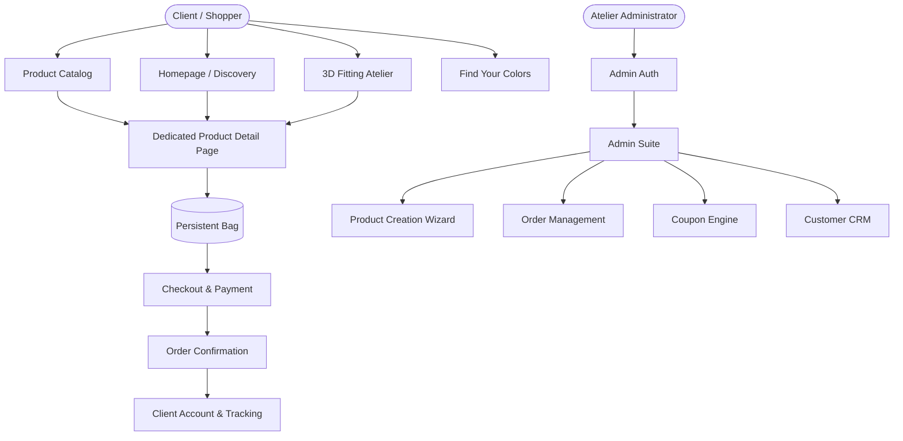
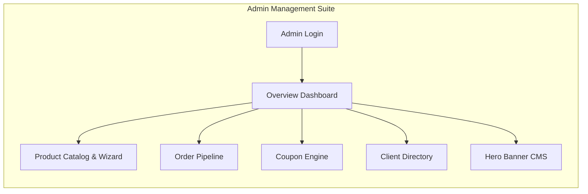
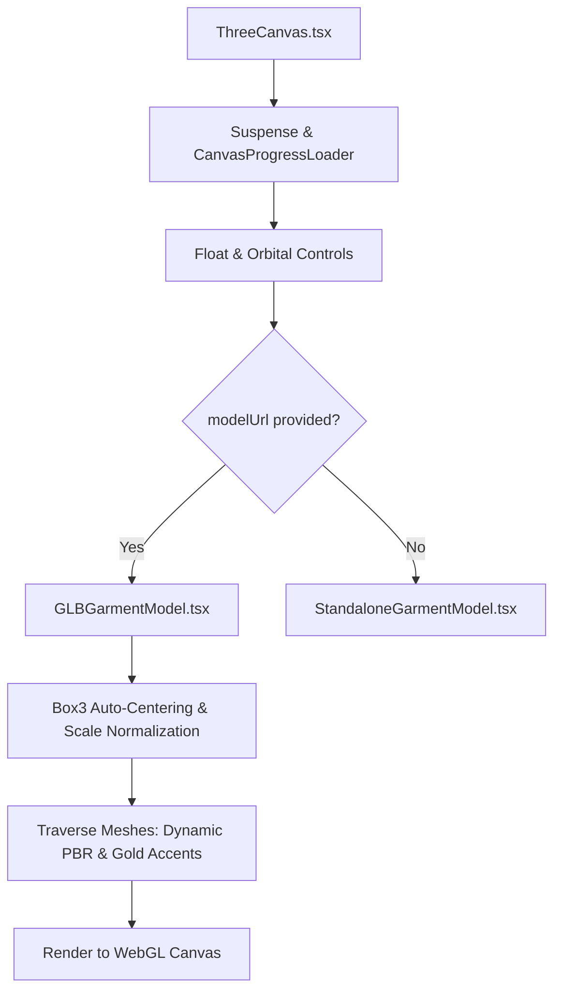

# VEYRA Luxury Fashion — Complete System Architecture & Operational Manual

> **Version:** 2.0.0 (Production Release)  
> **Repository:** `sanjeev8085/VEYRA`  
> **Technology Stack:** React 18, TypeScript, Vite, Three.js, React Three Fiber (@react-three/fiber), React Three Drei (@react-three/drei), Zustand (Persistent State), Lucide Icons, Vanilla CSS Design System.

---

## Table of Contents

1. [Executive Overview & Brand Architecture](#1-executive-overview--brand-architecture)
2. [Complete End-to-End User Journey & Page Flows](#2-complete-end-to-end-user-journey--page-flows)
   - [2.1 Homepage & Haute Couture Discovery](#21-homepage--haute-couture-discovery)
   - [2.2 3D Fitting Atelier Studio (`/studio`)](#22-3d-fitting-atelier-studio-studio)
   - [2.3 Product Catalog & Filtering Matrix (`/catalog`)](#23-product-catalog--filtering-matrix-catalog)
   - [2.4 Dedicated Desktop-First Product Detail Page (`/product/:slug`)](#24-dedicated-desktop-first-product-detail-page-productslug)
   - [2.5 Color Undertone & Analysis Studio (`/find-your-colors`)](#25-color-undertone--analysis-studio-find-your-colors)
   - [2.6 Shopping Bag, Wishlist, Checkout & Order Success](#26-shopping-bag-wishlist-checkout--order-success)
   - [2.7 Client Account & Order Tracking (`/account`)](#27-client-account--order-tracking-account)
3. [Admin Atelier & Management Suite](#3-admin-atelier--management-suite)
   - [3.1 Admin Authentication & Session Security](#31-admin-authentication--session-security)
   - [3.2 Analytics Dashboard & Key Metrics](#32-analytics-dashboard--key-metrics)
   - [3.3 Product Creation Wizard (10-Step & Instant Publish)](#33-product-creation-wizard-10-step--instant-publish)
   - [3.4 Inventory, Orders, Coupons, and Client Directory](#34-inventory-orders-coupons-and-client-directory)
4. [State Management & Data Persistence (`useStore.ts`)](#4-state-management--data-persistence-usestorets)
   - [4.1 Storage Schema & Versioning (`veyra-storage-v6`)](#41-storage-schema--versioning-veyra-storage-v6)
   - [4.2 Comprehensive Method Reference](#42-comprehensive-method-reference)
5. [3D WebGL Engine & Asset Pipeline](#5-3d-webgl-engine--asset-pipeline)
   - [5.1 Component Architecture](#51-component-architecture)
   - [5.2 3D Model Ingestion & Normalization](#52-3d-model-ingestion--normalization)
   - [5.3 Dynamic PBR Material Tinting & Champagne Gold Accents](#53-dynamic-pbr-material-tinting--champagne-gold-accents)
   - [5.4 GPU Performance & Adaptive DPR](#54-gpu-performance--adaptive-dpr)
6. [Design System & Responsive Architecture](#6-design-system--responsive-architecture)
   - [6.1 Responsive Breakpoint System](#61-responsive-breakpoint-system)
   - [6.2 Color Palette, Glassmorphism, and Typography Tokens](#62-color-palette-glassmorphism-and-typography-tokens)
7. [Complete Codebase Directory & File Map](#7-complete-codebase-directory--file-map)

---

## 1. Executive Overview & Brand Architecture

**VEYRA** is a digital luxury maison uniting artisanal tailoring with real-time WebGL garment simulation. The platform provides a seamless e-commerce journey where clients inspect garments in full 360° orbital 3D space, customize yarn shades in real time, analyze complexion suitability, and purchase garments through a streamlined checkout flow.



---

## 2. Complete End-to-End User Journey & Page Flows

### 2.1 Homepage & Haute Couture Discovery
* **URL:** `/#/`
* **File:** `src/pages/home/HomePage.tsx`
* **Key Components & Sections:**
  1. **Sticky Luxury Header (`Header.tsx`):** Unbreakable single-line `VEYRA` brand logo, navigation links (Atelier Studio, Catalog, Color Analysis, Collections), Currency switcher (INR, USD, EUR, GBP), Wishlist counter, and Bag modal trigger.
  2. **Hero 3D Canvas Section:** Editorial banner showcasing flagship collections, dynamic lighting controls, and CTAs to enter the 3D studio.
  3. **Curated T-Shirt Atelier (`Section 3`):** 4-column responsive grid rendering live 3D product cards with real-time color swatching, silhouette toggle, and direct navigation.
  4. **The Draping Atelier Studio (`Section 4`):** Interactive 3D garment viewport draped over male/female mannequins with custom lighting presets (*Studio Gold*, *Sunset Boulevard*, *Cyber Runway*).
  5. **Artisanal Tailored Shirts (`Section 5`):** Normandy flax linen and Oxford cotton button-downs in alternating 3D models.
  6. **Customer Testimonials & Brand Manifesto:** Social proof, craftsmanship badges, and sustainability guarantees.

---

### 2.2 3D Fitting Atelier Studio (`/studio`)
* **URL:** `/#/studio`
* **File:** `src/pages/studio/Studio3DPage.tsx`
* **Flow & Functionality:**
  - Full-screen interactive WebGL viewport rendering garments in real time.
  - **Mannequin / Avatar Selection:** Switch between Haute Couture Dress Form, Male Posture, and Female Posture.
  - **Studio Lighting Controls (`ViewportControls.tsx`):** Toggle between ambient studio, directional key light, and warm sunset Kelvin tones.
  - **Live Customization Palette:** Select any curated swatch (*Botanical Sage, Earthy Terracotta, Ivory Linen, Capri Sky Blue, Vintage Burgundy, Midnight Navy*) to dynamically re-tint the 3D garment fabric.
  - **Inspect & Order CTA:** Single-click navigation to the dedicated product detail page for the active 3D configuration.

---

### 2.3 Product Catalog & Filtering Matrix (`/catalog`)
* **URL:** `/#/catalog`
* **File:** `src/pages/catalog/CatalogPage.tsx`
* **Flow & Functionality:**
  - **Multi-Faceted Filter Drawer / Sidebar:**
    - Categories: *All, T-Shirts, Shirts, Jackets, Trousers*
    - Fabric Types: *Supima Cotton, Normandy Linen, Giza Cotton, Silk Blend, Selvedge Chambray*
    - Price Range slider with instant currency formatting.
    - Color shade filter chips.
    - Sort By: *Featured, Price: Low to High, Price: High to Low, Rating, New Arrivals*.
  - **Clean 4-Column Responsive Grid (`.product-catalog-grid`):**
    - Compact, elegant 3D cards (`ProductCard3D.tsx`).
    - Entire card is clickable to open the dedicated Product Detail Page.
    - Quick actions (Wishlist, Quick Bag, Shade selection) update state without page reload.

---

### 2.4 Dedicated Desktop-First Product Detail Page (`/product/:slug`)
* **URL:** `/#/product/:slug` or `/#/product/:id`
* **File:** `src/pages/product/ProductDetailPage.tsx`
* **Architecture:**
  - **Left Column (Controlled Media & 3D Viewport):**
    - High-performance 3D Canvas (`ThreeCanvas.tsx`) loading the garment's exact GLB model (`veyra_professional_signature_tee.glb` or `veyra_signature_tshirt.glb`).
    - 360° orbital rotation, zoom, drag, and shadow rendering.
    - Format switcher: **"3D Atelier"** (WebGL interactive) $\leftrightarrow$ **"Photo Gallery"** (Editorial lookbook).
    - Multi-angle thumbnail tray below the main preview.
  - **Right Column (Product Intelligence & Commerce Matrix):**
    - Brand & Category breadcrumb with live stock status badge.
    - Product title, retail price, strike-through original price, and percentage discount badge.
    - Star ratings with direct link to client review section.
    - Interactive color swatch matrix with real-time 3D model re-tinting.
    - Size selection chips (`S`, `M`, `L`, `XL`) with measurement guide modal trigger.
    - Accessible Quantity Selector (`- 1 +`).
    - **Primary Actions:**
      - `Add to Bag`: Adds configured item to shopping bag.
      - `Buy Now`: Express single-click checkout routing straight to `/#/checkout`.
      - `Wishlist`: Instant toggle with animated heart icon.
    - Luxury guarantee strip: Complimentary courier, organic yarns, 30-day returns.
  - **Deep Information Accordion:**
    - *Fabric & Craftsmanship:* GSM weight, yarn origin, weaving technique, care instructions.
    - *Shipping & Delivery:* Transit timeline and live GPS tracking details.
  - **Client Reviews & Rating Submission:** Verified customer reviews with dynamic star filtering and submission form.
  - **Curated Related Creations:** 4-column responsive grid of complementary garments.

---

### 2.5 Color Undertone & Analysis Studio (`/find-your-colors`)
* **URL:** `/#/find-your-colors`
* **File:** `src/pages/color-finder/FindYourColorsPage.tsx`
* **Flow:**
  - Interactive questionnaire assessing skin undertones (Warm, Cool, Neutral, Olive) and natural contrast.
  - Algorithmically generates a tailored palette recommendation (*Spring Warmth, Summer Cool, Autumn Earth, Winter Contrast*).
  - Matches recommendations directly to VEYRA garment swatches with one-click catalog filtering.

---

### 2.6 Shopping Bag, Wishlist, Checkout & Order Success
* **Bag Drawer (`CartDrawer.tsx`):** Slide-out drawer with item quantity adjustments, size/color variant tags, free shipping threshold indicator, and subtotal calculation.
* **Wishlist Drawer (`WishlistDrawer.tsx`):** Slide-out drawer of favorited garments with one-click "Move to Bag" action.
* **Checkout Page (`CheckoutPage.tsx`):**
  - Multi-step address input, delivery method selection (Standard vs Express White Glove), coupon application engine (`WELCOME10`, `LUXURY20`, `VEYRAVIP`), and payment options (Credit/Debit Card, UPI, Net Banking, Cash on Delivery).
* **Order Confirmation (`OrderConfirmationPage.tsx`):** Unique order number generation (`VYR-ORD-XXXX`), full itemized summary, delivery timeline, and direct button to account order history.

---

### 2.7 Client Account & Order Tracking (`/account`)
* **URL:** `/#/account`
* **File:** `src/pages/account/AccountPage.tsx`
* **Features:** Order history matrix with delivery tracking badges, saved shipping addresses, personalized size profile, and wishlist archive.

---

## 3. Admin Atelier & Management Suite



### 3.1 Admin Authentication & Session Security
* **URL:** `/#/admin/login`
* **File:** `src/pages/admin/AdminLoginPage.tsx`
* **Default Credentials:**
  - **Email:** `admin@veyra.luxury`
  - **Password:** `admin123`
  - *Instant Demo Login Button* provided for immediate zero-friction evaluation.

### 3.2 Analytics Dashboard & Key Metrics
* **URL:** `/#/admin`
* **File:** `src/pages/admin/AdminDashboardPage.tsx`
* **Live KPIs:** Total Gross Revenue, Total Orders, Average Order Value (AOV), Active Products count, and Live Inventory Alerts.

### 3.3 Product Creation Wizard
* **URL:** `/#/admin/products/add`
* **File:** `src/pages/admin/AddProductWizard.tsx`
* **Dual Publishing Modes:**
  1. **Instant Header Publish Button:** Fill basic fields and click **"Publish Product"** at the top right for instant publishing without stepping through all wizard steps.
  2. **10-Step Comprehensive Wizard:**
     - Step 1: Basic Information (Name, Brand, Category, Slug)
     - Step 2: Pricing, MRP & Discounts
     - Step 3: Fabric & Sustainability Specs (GSM, Yarn type, Care)
     - Step 4: Editorial Media (Lookbook URLs, Drag & Drop uploads)
     - Step 5: 3D Model Attachment (`.glb` URL or file assignment)
     - Step 6: Variant Matrix (Size x Color x Stock x SKU generator)
     - Step 7: Size & Measurement Chart specification
     - Step 8: SEO Metadata & OpenGraph preview
     - Step 9: Collection & Tags assignment
     - Step 10: Final Inspection & Live Storefront Deployment

---

## 4. State Management & Data Persistence (`useStore.ts`)

The entire client and administrator application is powered by a high-performance **Zustand** store configured with `zustand/middleware/persist` saving to `localStorage`.

### 4.1 Storage Schema & Versioning
* **Current Storage Key:** `veyra-storage-v6`
* **Persisted Entities:** `cart`, `wishlist`, `user`, `adminSession`, `isAdminAuthenticated`, `products`, `coupons`, `customers`, `homepageHeroSettings`, `addresses`, `orders`, `activeAvatarId`, `currency`, `theme`.

```typescript
// Example: Cart & Product Item Schema
interface CartItem {
  id: string;
  product: Product;
  size: string;
  colorName: string;
  colorHex: string;
  quantity: number;
}
```

### 4.2 Comprehensive Method Reference

| Method Category | Method Name | Signature & Purpose |
| :--- | :--- | :--- |
| **Shopping Cart** | `addToCart` | `(product, size, colorName, colorHex, quantity?) => void`<br>Adds item to cart; increments quantity if exact variant exists. |
| | `removeFromCart` | `(cartItemId: string) => void`<br>Removes specific item from shopping bag. |
| | `updateCartQuantity` | `(cartItemId: string, delta: number) => void`<br>Increments/decrements quantity with zero-clamp removal. |
| | `clearCart` | `() => void`<br>Empties the bag upon checkout completion. |
| **Wishlist** | `toggleWishlist` | `(productId: string) => void`<br>Adds/removes product from user's wishlist. |
| | `isInWishlist` | `(productId: string) => boolean`<br>Returns boolean status for heart icon highlight. |
| **Catalog CRUD** | `addProduct` | `(product: Product) => void`<br>Inserts new product into catalog and seeds inventory. |
| | `updateProduct` | `(id: string, updates: Partial<Product>) => void`<br>Updates product pricing, media, or variants. |
| | `deleteProduct` | `(id: string) => void`<br>Removes product from active storefront catalog. |
| **Coupon Engine** | `applyCoupon` | `(code: string) => { success: boolean; discount: number; message: string }`<br>Validates code, calculates percentage/flat discount against cart subtotal. |
| | `removeCoupon` | `() => void`<br>Removes currently active coupon. |
| **Orders & Checkout**| `createOrder` | `(orderData: OrderInput) => Order`<br>Generates order ID, deducts variant stock, records customer profile, clears cart. |
| **Atelier Settings** | `setCurrency` | `(currency: 'INR' \| 'USD' \| 'EUR' \| 'GBP') => void`<br>Updates global currency formatting across the entire app. |
| | `setActiveLightingPreset` | `(preset: 'studio' \| 'sunset' \| 'runway') => void`<br>Adjusts WebGL scene lights and color temperature. |

---

## 5. 3D WebGL Engine & Asset Pipeline



### 5.1 Component Architecture
1. **`ThreeCanvas.tsx`:** Master WebGL canvas wrapper containing `<Canvas>`, `<OrbitControls>`, `<PerspectiveCamera>`, ambient/directional lights, `<ContactShadows>`, and adaptive DPR scaling.
2. **`GLBGarmentModel.tsx`:** High-performance GLTF loader utilizing `@react-three/drei`'s `useGLTF`. Automatically normalizes bounding boxes, centers geometric pivot points, and traverses node hierarchies.
3. **`StandaloneGarmentModel.tsx` & `GarmentModel.tsx`:** Procedural geometric models serving as instantaneous fallbacks.
4. **`ModelLoader.tsx`:** Error boundary trapping WebGL context loss or asset loading issues, rendering clean vector flatlays on warm cream backgrounds.
5. **`ViewportControls.tsx`:** Floating UI control overlay allowing studio lighting adjustments and camera angle resets.

### 5.2 3D Model Ingestion & Normalization
Models placed in `public/models/garments/` are automatically served:
- **`veyra_professional_signature_tee.glb` (391 KB):** 31 sub-meshes with 3D embossed gold **VEYRA** chest lettering, gold piping, collar ribbing, and shoulder seams.
- **`veyra_signature_tshirt.glb` (42 KB):** 6 sub-meshes with drop-shoulder cotton drape, micro-ribbed crewneck, and finished hem.

### 5.3 Dynamic PBR Material Tinting & Gold Accents
`GLBGarmentModel.tsx` traverses all 3D mesh nodes:
- **Gold Accent Nodes (`logo_`, `gold_`, `tag`, `piping`, `label`):** Rendered with champagne gold PBR material (`color: #d4af37`, `metalness: 0.85`, `roughness: 0.25`).
- **Collar & Hem Ribbing (`collar`, `ribbed`, `hem`):** Rendered with a slightly offset dark-toned matte cotton texture.
- **Garment Body Meshes:** Tinted dynamically to match the user's active color swatch (`colorHex`) with realistic cotton roughness (`0.65`) and subtle sheen (`metalness: 0.02`).

---

## 6. Design System & Responsive Architecture

### 6.1 Responsive Breakpoint System

| Device Class | Viewport Range | Grid Architecture | Card Height |
| :--- | :--- | :--- | :--- |
| **Large Desktop** | `≥ 1200px` | 4 Columns (`repeat(4, 1fr)`) | Controlled `280px` 3D Viewport |
| **Standard Laptop** | `900px – 1199px` | 3 Columns (`repeat(3, 1fr)`) | Controlled `260px` 3D Viewport |
| **Tablet & Phones** | `361px – 899px` | 2 Columns (`repeat(2, 1fr)`) | `240px` 3D Viewport |
| **Micro Mobile** | `≤ 360px` | 1 Column (`100%`) | `220px` 3D Viewport |

### 6.2 Color Palette, Glassmorphism, and Typography Tokens
- **Background Deep:** `#09090b` (Dark Mode Luxury) / `#fdfcf9` (Warm Cream Editorial Mode)
- **Accent Champagne Gold:** `#c59b27` / `#d4af37`
- **Text Primary:** `#ffffff` (Dark) / `#1a1a1a` (Light)
- **Glassmorphic Panels:** `background: rgba(20, 20, 26, 0.65); backdrop-filter: blur(16px); border: 1px solid rgba(197, 155, 39, 0.15);`
- **Typography:** Display serif for titles (`Playfair Display` / `Cinzel` / `Outfit`) paired with geometric sans-serif (`Inter`) for editorial readability.

---

## 7. Complete Codebase Directory & File Map

```text
d:/sanjeev_tyagi/VEYRA/
├── doc/                                # Architectural manuals & requirements
│   ├── VEYRA_FULL_SYSTEM_MANUAL.md     # This comprehensive guide
│   ├── VEYRA_ARCHITECTURE.md           # Architecture overview
│   └── Admin_User_Guide.md             # Administrator user guide
├── public/                             # Public static assets
│   └── models/garments/                # 3D GLTF / GLB Garment Models
│       ├── veyra_professional_signature_tee.glb
│       └── veyra_signature_tshirt.glb
├── src/
│   ├── components/
│   │   ├── catalog/
│   │   │   └── ProductCard3D.tsx       # Interactive 3D Product Card
│   │   ├── common/
│   │   │   └── SEO.tsx                 # Dynamic OpenGraph & Meta tags
│   │   ├── layout/
│   │   │   ├── Header.tsx              # Sticky header with brand logo
│   │   │   ├── Footer.tsx              # Global footer & navigation
│   │   │   ├── CartDrawer.tsx          # Slide-out bag modal
│   │   │   └── WishlistDrawer.tsx      # Slide-out wishlist modal
│   │   ├── product/
│   │   │   ├── FallbackGallery.tsx     # Editorial photo lookbook
│   │   │   └── ReviewSection.tsx       # Verified buyer ratings & reviews
│   │   └── three/
│   │       ├── ThreeCanvas.tsx         # Master Three.js WebGL viewport
│   │       ├── GLBGarmentModel.tsx     # GLB asset loader & tinting engine
│   │       ├── GarmentModel.tsx        # Procedural garment generator
│   │       ├── MannequinModel.tsx      # Haute couture dress form
│   │       ├── ModelLoader.tsx         # WebGL loading bar & error boundary
│   │       └── ViewportControls.tsx    # Lighting & camera orbital controls
│   ├── data/
│   │   └── seedData.ts                 # Catalog products, collections, avatars
│   ├── pages/
│   │   ├── account/
│   │   │   └── AccountPage.tsx         # Client orders & profile
│   │   ├── admin/
│   │   │   ├── AdminDashboardPage.tsx  # Executive KPI analytics
│   │   │   ├── AdminLoginPage.tsx      # Admin authentication
│   │   │   └── AddProductWizard.tsx    # 10-step / instant publish wizard
│   │   ├── catalog/
│   │   │   └── CatalogPage.tsx         # Filterable multi-column catalog
│   │   ├── checkout/
│   │   │   ├── CheckoutPage.tsx        # Express checkout & coupon engine
│   │   │   └── OrderConfirmationPage.tsx # Order invoice & GPS tracking
│   │   ├── color-finder/
│   │   │   └── FindYourColorsPage.tsx  # Undertone & complexion analyzer
│   │   ├── home/
│   │   │   └── HomePage.tsx            # Flagship discovery experience
│   │   ├── product/
│   │   │   └── ProductDetailPage.tsx   # Dedicated desktop-first PDP
│   │   └── studio/
│   │       └── Studio3DPage.tsx        # 3D Fitting Atelier Studio
│   ├── store/
│   │   └── useStore.ts                 # Master Zustand persistent state
│   ├── styles/
│   │   ├── index.css                   # Global luxury CSS design system
│   │   └── responsive.css              # Responsive grid & overflow rules
│   ├── types/
│   │   └── index.ts                    # TypeScript interface definitions
│   ├── App.tsx                         # Router configuration & providers
│   └── main.tsx                        # React application bootstrap
├── package.json                        # Project dependencies & scripts
├── vite.config.ts                      # Vite build & asset configuration
└── tsconfig.json                       # TypeScript compiler options
```

---

*Document compiled and verified for the VEYRA Luxury Fashion Platform.*
